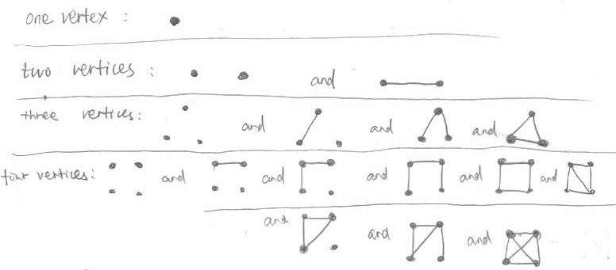
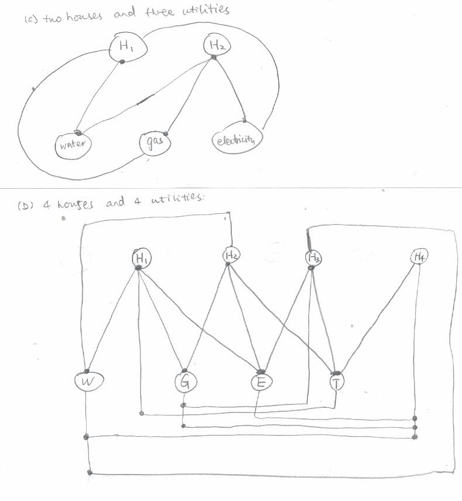

## 1-1

## 1-2

## 1-3

1. Company hierarchy: each person is a vertex and the relationship of "reporting to" are edges.
2. Mail Delivery: and post office and each destination is a vertex and the roads are edges. 
3. Computer network: each pc is a vertex and the routes are edges
4. Family tree: vertex：member, edge: relationship
5. Social network: vertex: person, edge: relationship
6. Map: vertex: cities, edge: roads
7. Google scholar coorperation: vertex: scholar, edge: coauthership
8. Human skeleton: vertex: bones, edges: joints
9. Human nerves: vertex: sensors, edges:  nerve fibers
10. Keywords relationships: vertex: keywords, edges: keywords occuring together

