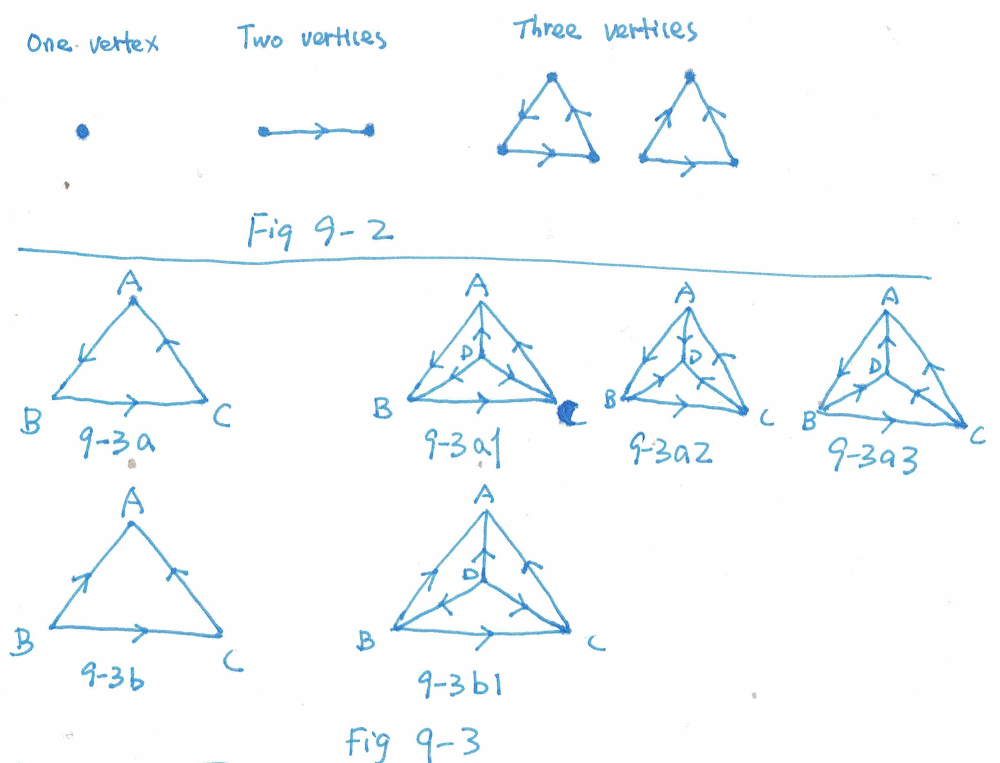
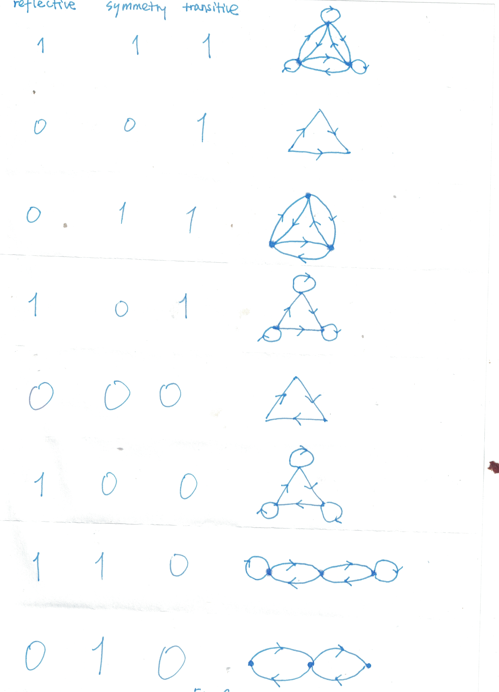
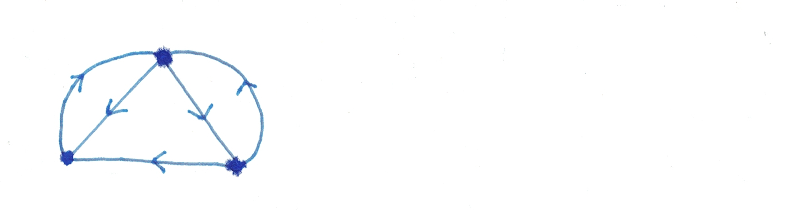
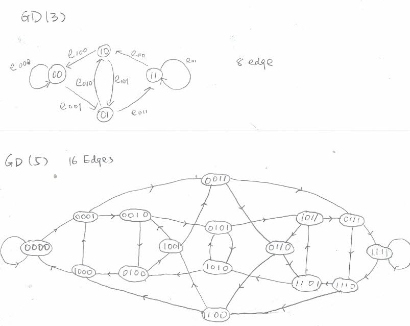

## 9-1 

Consider each edge. It counts for one in-edge for a certain vertex and one out-edge for another vertex. Therefore, 

(sum of all in-degrees) == (sum of all out-degrees) == (edges count)

## 9-2 

This is shown in Fig 9.2

## 9-3

This is shown in Fig 9.3.

All the directions are in 9-3a1, 9-3a2, 9-3a3 and 9-3b1.

Explanation from relations:

Consider edge pointing from A to B means that A beats B.

Consider the relationship in 9-3a, which represents a round-robin tournament of tie of 3 players. We call this a "3-tie".

9-3a1 represents one 3-tie and another player beats all ones in the 3-tie.

9-3a2 represents one 3-tie and another player beaten by all from the 3-tie.

9-3a3 represents two 3-ties formed(ABC and ABD), in which case, ACD and BCD must be definite ranking as shown in figure 9-3b.

9-3b represents a definate ranking: B better than C, C better than A.

9-3b1 represents a definate ranking among four players: D better than B, B better than C, C better than A.

## 9-4

Fig 9-3b and Fig 9-3b1 are two examples of strict partial ordering.

---

Proof that strict partial ordering must be acyclic:

Suppose a circuit exists, from a1, going through, a2, a3, till ai and finally going back to a1.

Since the transitive rule, there must be an edge from a1 to ai directly. Since there is also one edge pointing from ai to a1, these two edges contradict the assumption that the graph is asymmetric. End.

---

Removing edge BA from Fig 9-3b, we get one acyclic graph, which is not strictly partial order since it does not satisfy the transitive rule. 

## 9-5

## 9-7

Consider an edge e from vertex A to vertex B. 

If e is not included in any circuits, itself must be a directed cut-set.

Therefore e must be in a circuit, if it is not in a directed circuit, then it must be in a semicircuit.

We therefore just need to find one directed cut set that e is in, if e is only in semicircuits.

Consider the semicircuit set C with m elements, which are all the semicircuits that e is in. Take each element Ci from C, in Ci there must be another edge e_ci, pointing in different direction along the circuit than e. e and e_ci together break the two paths from A to B.

Consider the set E containing e, e_c1, e_c2, .... e_cm, this set breaks all the paths connecting A and B. Consider any spanning tree containing e, cutting e break the spanning tree to two components ComponentA containing A and componentB containing B. The fundamental cut set relative to this spanning tree for edge e must be a subset of E, whose all elements points from componentA to componentB which is a directed cut set.

## 9-8

calculate the matrix of X^1 + x^2 + ... + X^(n-1). Ceil all the elements of the elements there to 1, we then get a reachability matrix.

## 9-9

It is possible, consider the figure in question 9-6, in the 0-0-0 case of non-reflective, non-symmetry and non-transitive and the 0-1-0 case of non-reflective, symmetry and non-transitive. 

In both graph, we could reach from one edge to any other edge. 

But they are non-isomorphic.

## 9-10

Consider S = R^2; S_i is the sum of all R_ij * R_ji where j counts from 1 to the number of vertices.

R_ij*R_ji == 1 if and only if R_ij == R_ji == 1 which means that vertex i and vertex j are strongly connected.

Since strong connectivity is transitive, S_i therefore equals to the number of vertices in the fragment containing vertex i.

## 9-11
step 1, 

find all the vertices numbers reachable from vertex 1.
For each of the vertices found in 1, say v_i, find all the reachable vertices from v_i, which must also be reachable from vertex 1.

add these newly reachable vertices to the first row. 

step 2, 3
discover newly transitively reachable vertices through the newly added vertices in step 1.

step 4
do step 1, 2, 3 for all the rows

## 9-12

---
First we prove that if digraph is strongly connected, M = X + X^2 + ... + X^n must have non element that is zero:

Since the digraph is strongly connected, there is one directed path from one vertex to another, this path must contain no more than n - 1 edges and thus all the X + X^2 + ... + X^(n-1) must have all none-diagonal elements not being zero.

Then for any vertex v, there must be at least a directed circuit containing v, with no more than n edges. Therefore X + X^2 + ... + X^n must have the diagonal elements not being zero.

---
Second we prove that if M = X + X^2 + ... + X^n has all elements none zero, the graph is strongly connected.

From any vertex i to another vertex j, we have M_ij != 0. We therefore have a directed sequence of e1, e2, e3, ..., ei going through a sequence of possibly repeated vertices. We could always "trim" any directed circuits and get a directed path from vertex i to vertex j. Therefore it is strongly connected.

## 9-13

The same as the second part of 9-12, we could always trim any directed circuits and get a directed path.

The reverse is not true as shown in the figure below:

## 9-14

All the euler paths are:

e1 - e2 - e8 - e12 - e13 - e14 - e15 - e7 - e3 - e4 - e11 - e9 - e10 - e5 - e6 - e16

e1 - e2 - e8 - e12 - e13 - e14 - e10 - e11 - e9 - e15 - e7 - e3 - e4 - e5 - e6 - e16

e1 - e2 - e8 - e12 - e13 - e14 - e10 - e5 - e4 - e11 - e9 - e15 - e7 - e3 - e6 - e16

e1 - e2 - e8 - e12 - e13 - e14 - e10 - e5 - e6 - e7 - e3 - e4 - e11 - e9 - e15 - e16

e1 - e2 - e8 - e9 - e15 - e7 - e3 - e4 - e11 - e12 - e13 - e14 - e10 - e5 - e6 - e16

e1 - e2 - e8 - e9 - e10 - e11 - e12 - e13 - e14 - e15 - e7 - e3 - e4 - e5 - e6 - e16

e1 - e2 - e8 - e9 - e10 - e5 - e4 - e11 - e12 - e13 - e14 - e15 - e7 - e3 - e6 - e16

e1 - e2 - e8 - e9 - e10 - e5 - e6 - e7 - e3 - e4 - e11 - e12 - e13 - e14 - e15 - e16

e1 - e2 - e3 - e4 - e11 - e12 - e13 - e14 - e15 - e7 - e8 - e9 - e10 - e5 - e6 - e16

e1 - e2 - e3 - e4 - e11 - e12 - e13 - e14 - e10 - e5 - e6 - e7 - e8 - e9 - e15 - e16

e1 - e2 - e3 - e4 - e11 - e9 - e15 - e7 - e8 - e12 - e13 - e14 - e10 - e5 - e6 - e16

e1 - e2 - e3 - e4 - e11 - e9 - e10 - e5 - e6 - e7 - e8 - e12 - e13 - e14 - e15 - e16

e1 - e2 - e3 - e4 - e5 - e6 - e7 - e8 - e12 - e13 - e14 - e10 - e11 - e9 - e15 - e16

e1 - e2 - e3 - e4 - e5 - e6 - e7 - e8 - e9 - e10 - e11 - e12 - e13 - e14 - e15 - e16

e1 - e2 - e3 - e6 - e7 - e8 - e12 - e13 - e14 - e10 - e5 - e4 - e11 - e9 - e15 - e16

e1 - e2 - e3 - e6 - e7 - e8 - e9 - e10 - e5 - e4 - e11 - e12 - e13 - e14 - e15 - e16

## 9-15

## 9-16

GD(r+1)'s vertices are all possible sequence of r 0/1s. 
GD(r)'s vertices are all possible sequence of r-1 0/1s. GD(r+1)'s edges are all possible sequence of r 0/1s. There is therefore one to one correspondence between GD(r)'s edges and GD(r+1)'s vertices.  

Consider one vertex in GD(r), which is x_1 x_2 x_3 ... x_r. One edge going in is e_in = x_0 x_1 x_2 ... x_r, another edge going out is e_out = x_1 x_2 ... x_r x_r+1, all of the x_k are 0 or 1.

Note that both e_in and e_out are vertices v_in and v_out in GD(r+1) correspondingly.  There is one new edge from v_in to v_out which is x_0 x_1 x_2 ... x_r x_r+1. Therefore that GD(r+1) is a line digraph of GD(r).

